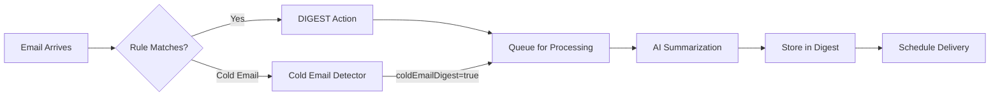

```

# Digest Feature Agent

## Purpose
This agent manages the AI-powered email digest system that helps users manage inbox overload by batching emails into periodic summary emails with AI-powered summarization and smart categorization.

## Core Responsibilities

### 1. Email Digest Processing
- Implement email batching and accumulation strategies
- Manage digest scheduling based on user preferences
- Handle AI-powered email summarization and categorization
- Create structured and unstructured summary formats

### 2. AI Summarization Pipeline
- Extract structured data from receipts, orders, and events
- Generate unstructured summaries for newsletters and notes
- Implement category-aware processing based on content type
- Ensure privacy through content redaction after processing

### 3. Digest Delivery System
- Schedule digest emails based on user preferences
- Generate categorized email summaries
- Implement atomic digest storage and processing
- Handle digest status tracking (PENDING, PROCESSING, SENT)

## Implementation Architecture

### Email Trigger System


### Digest Processing Pipeline
```typescript
// apps/web/utils/digest/processor.ts
import { enqueueDigestItem } from './queue';
import { aiSummarizeEmailForDigest } from './ai-summation';
import { upsertDigest } from './storage';

export async function processEmailForDigest({
  email,
  emailAccountId,
  actionId,
  coldEmailId
}: {
  email: ParsedMessage;
  emailAccountId: string;
  actionId?: string;
  coldEmailId?: string;
}) {
  try {
    // Queue email for AI processing
    await enqueueDigestItem({
      email,
      emailAccountId,
      actionId,
      coldEmailId
    });

    console.log(`Email queued for digest processing: ${email.messageId}`);
  } catch (error) {
    console.error('Failed to queue email for digest:', error);
    throw error;
  }
}

export async function processDigestQueue() {
  // Process queued items with AI summarization
  const queue = await getPendingDigestItems();
  
  for (const item of queue) {
    try {
      const summary = await aiSummarizeEmailForDigest(
        item.ruleName || 'general',
        item.emailAccount,
        item.email
      );
      
      await upsertDigest({
        messageId: item.email.messageId,
        threadId: item.email.threadId,
        emailAccountId: item.emailAccountId,
        actionId: item.actionId,
        coldEmailId: item.coldEmailId,
        content: summary,
        category: item.ruleName || 'general'
      });
      
      await markItemAsProcessed(item.id);
    } catch (error) {
      console.error('Failed to process digest item:', error);
      await markItemAsFailed(item.id, error.message);
    }
  }
}
```

### AI Summarization System
```typescript
// apps/web/utils/digest/ai-summarization.ts
import { getModel } from '@/utils/llms/model';

export async function aiSummarizeEmailForDigest(
  ruleName: string,
  emailAccount: EmailAccountWithAI,
  email: ParsedMessage
) {
  const model = getModel(emailAccount.aiProvider, emailAccount.aiModel);
  
  // Determine processing strategy based on category
  const category = categorizeEmailContent(ruleName, email);
  const prompt = createSummarizationPrompt(category, email);
  
  try {
    const result = await model.generateObject({
      prompt,
      schema: category === 'structured' ? structuredSchema : unstructuredSchema
    });
    
    return {
      category,
      summary: result,
      confidence: result.confidence || 0.8,
      processedAt: new Date().toISOString()
    };
  } catch (error) {
    console.error('AI summarization failed:', error);
    return {
      category: 'general',
      summary: { summary: 'Processing failed, please check original email' },
      confidence: 0,
      processedAt: new Date().toISOString()
    };
  }
}

function createSummarizationPrompt(category: string, email: ParsedMessage): string {
  const basePrompt = `
Analyze this email and create a summary for the digest:

Email Subject: ${email.subject}
From: ${email.from}
Content: ${email.snippet || email.body}

Category Context: ${category}
`;

  if (category === 'structured') {
    return basePrompt + `
Extract structured data in the following format:
{
  "entries": [
    { "label": "Order Number", "value": "#12345" },
    { "label": "Total", "value": "$99.99" },
    { "label": "Delivery Date", "value": "March 15, 2024" }
  ],
  "summary": "Brief description of the content",
  "confidence": 0-1
}
`;
  } else {
    return basePrompt + `
Create an unstructured summary:
{
  "summary": "1-2 sentence summary of key points",
  "tone": "professional/casual/neutral",
  "importance": "high/medium/low",
  "confidence": 0-1
}
`;
  }
}

const structuredSchema = {
  type: 'object',
  properties: {
    entries: {
      type: 'array',
      items: {
        type: 'object',
        properties: {
          label: { type: 'string' },
          value: { type: 'string' }
        },
        required: ['label', 'value']
      }
    },
    summary: { type: 'string' },
    confidence: { type: 'number', minimum: 0, maximum: 1 }
  },
  required: ['entries', 'summary', 'confidence']
};

const unstructuredSchema = {
  type: 'object',
  properties: {
    summary: { type: 'string' },
    tone: { type: 'string', enum: ['professional', 'casual', 'neutral'] },
    importance: { type: 'string', enum: ['high', 'medium', 'low'] },
    confidence: { type: 'number', minimum: 0, maximum: 1 }
  },
  required: ['summary', 'confidence']
};
```

### Digest Storage System
```typescript
// apps/web/utils/digest/storage.ts
import { prisma } from '@/utils/prisma';

export async function upsertDigest(digestData: {
  messageId: string;
  threadId: string;
  emailAccountId: string;
  actionId?: string;
  coldEmailId?: string;
  content: any;
  category: string;
}) {
  const { messageId, threadId, emailAccountId, content, category } = digestData;
  
  return await prisma.digestItem.upsert({
    where: {
      messageId_threadId_emailAccountId: {
        messageId,
        threadId,
        emailAccountId
      }
    },
    update: {
      content: JSON.stringify(content),
      category,
      updatedAt: new Date()
    },
    create: {
      messageId,
      threadId,
      emailAccountId,
      content: JSON.stringify(content),
      category,
      ...(digestData.actionId && { actionId: digestData.actionId }),
      ...(digestData.coldEmailId && { coldEmailId: digestData.coldEmailId })
    }
  });
}

export async function createDigestBatch(emailAccountId: string) {
  const pendingItems = await prisma.digestItem.findMany({
    where: {
      emailAccountId,
      digestId: null,
      createdAt: {
        lt: new Date(Date.now() - 24 * 60 * 60 * 1000) // Older than 24 hours
      }
    },
    include: {
      action: true,
      coldEmail: true
    }
  });

  if (pendingItems.length === 0) {
    return null;
  }

  // Create digest batch
  const digest = await prisma.digest.create({
    data: {
      emailAccountId,
      status: 'PENDING',
      items: {
        create: pendingItems.map(item => ({ id: item.id }))
      }
    }
  });

  return digest;
}

export async function sendDigestEmail(digestId: string) {
  const digest = await prisma.digest.findUnique({
    where: { id: digestId },
    include: {
      items: {
        include: {
          action: true
        }
      },
      emailAccount: {
        include: {
          user: true
        }
      }
    }
  });

  if (!digest) {
    throw new Error('Digest not found');
  }

  // Group items by category
  const categorizedItems = groupItemsByCategory(digest.items);
  
  // Generate email content
  const emailContent = await generateDigestEmailContent(categorizedItems);
  
  // Send email via Resend
  await sendDigestEmailViaResend({
    to: digest.emailAccount.user.email,
    content: emailContent,
    subject: `Your Inbox Zero Digest - ${new Date().toLocaleDateString()}`
  });

  // Mark as sent and redact content
  await prisma.digest.update({
    where: { id: digestId },
    data: {
      sentAt: new Date(),
      status: 'SENT',
      items: {
        updateMany: {
          where: { digestId },
          data: {
            content: JSON.stringify({ redacted: true }),
            redactedAt: new Date()
          }
        }
      }
    }
  });
}

function groupItemsByCategory(items: any[]) {
  const categories: Record<string, any[]> = {};
  
  items.forEach(item => {
    const category = item.category || 'general';
    if (!categories[category]) {
      categories[category] = [];
    }
    categories[category].push(item);
  });
  
  return categories;
}
```

### Schedule Management
```typescript
// apps/web/utils/digest/schedule.ts
import { prisma } from '@/utils/prisma';

export interface DigestSchedule {
  intervalDays: number;
  timeOfDay: string; // "HH:MM" format
  occurrences: number;
  daysOfWeek: number | null; // Bitmask for days of week
}

export async function scheduleDigest(digestId: string, schedule: DigestSchedule) {
  const nextSendTime = calculateNextSendTime(schedule);
  
  return await prisma.digestSchedule.create({
    data: {
      digestId,
      ...schedule,
      nextSendTime,
      status: 'SCHEDULED'
    }
  });
}

export async function processScheduledDigests() {
  const now = new Date();
  const dueDigests = await prisma.digestSchedule.findMany({
    where: {
      nextSendTime: { lte: now },
      status: 'SCHEDULED'
    },
    include: {
      digest: {
        include: {
          items: true,
          emailAccount: {
            include: {
              user: true
            }
          }
        }
      }
    }
  });

  for (const schedule of dueDigests) {
    try {
      await sendDigestEmail(schedule.digestId);
      
      // Calculate next send time
      const nextSendTime = calculateNextSendTime(schedule);
      
      await prisma.digestSchedule.update({
        where: { id: schedule.id },
        data: {
          lastSentAt: new Date(),
          nextSendTime,
          status: 'SCHEDULED'
        }
      });
    } catch (error) {
      console.error('Failed to send scheduled digest:', error);
      
      await prisma.digestSchedule.update({
        where: { id: schedule.id },
        data: {
          status: 'FAILED',
          error: error.message
        }
      });
    }
  }
}

function calculateNextSendTime(schedule: DigestSchedule): Date {
  const now = new Date();
  const [hours, minutes] = schedule.timeOfDay.split(':').map(Number);
  
  const nextTime = new Date(now);
  nextTime.setHours(hours, minutes, 0, 0);
  
  if (nextTime <= now) {
    nextTime.setDate(nextTime.getDate() + schedule.intervalDays);
  }
  
  // Adjust for specific days of week if specified
  if (schedule.daysOfWeek !== null) {
    const targetDays = getDaysFromBitmask(schedule.daysOfWeek);
    const currentDay = nextTime.getDay();
    
    let daysToAdd = 0;
    for (let i = 1; i <= 7; i++) {
      const checkDay = (currentDay + i) % 7;
      if (targetDays.includes(checkDay)) {
        daysToAdd = i;
        break;
      }
    }
    
    if (daysToAdd > 0) {
      nextTime.setDate(nextTime.getDate() + daysToAdd);
    }
  }
  
  return nextTime;
}

function getDaysFromBitmask(bitmask: number): number[] {
  const days: number[] = [];
  for (let i = 0; i < 7; i++) {
    if (bitmask & (1 << i)) {
      days.push(i);
    }
  }
  return days;
}
```

## Database Schema
```prisma
// apps/web/prisma/schema.prisma

model Digest {
  id             String        @id @default(cuid())
  emailAccountId String
  status         DigestStatus  @default(PENDING)
  sentAt         DateTime?
  createdAt      DateTime      @default(now())
  updatedAt      DateTime      @updatedAt
  
  emailAccount   EmailAccount  @relation(fields: [emailAccountId], references: [id], onDelete: Cascade)
  items          DigestItem[]
  schedule       DigestSchedule?
}

model DigestItem {
  id          String       @id @default(cuid())
  messageId   String       // Gmail message ID
  threadId    String       // Gmail thread ID
  content     String       @db.Text // JSON summary
  category    String       // Digest category
  redactedAt  DateTime?
  digestId    String